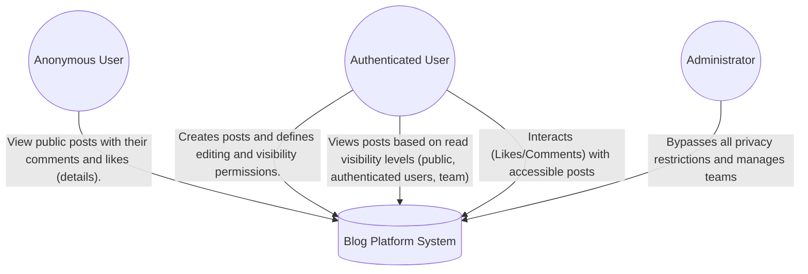
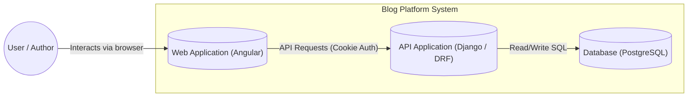

# Blog Platform - Client

## Project Name
blog_project

## Project Description
This is the **Angular** frontend application for the blog_project. It provides a modern and responsive user interface to interact with the Blog API. The application manages state, routing, and secure communication with the backend to provide a seamless blogging experience.

Key features include dynamic content filtering based on user permissions, a nested comment system, and comprehensive post management.

## Architecture (C4 Model)

### Level 1: System Context
This diagram shows how different users interact with the Blog API and external services.

### Level 2: Containers View
This diagram ilustrates the internal parts of the system and how the Backend (Django) serves the Frontend (Angular) and persists data.


## Key Functionalities

### Authentication & Session
- Identity Management: Registration and login interfaces.
- Session Persistence: Secure handling of session cookies to maintain authentication across refreshes.
- Guarded Routes: Protection of private views (like creating or editing posts) to ensure only authenticated users can access them.

### Content Management
- Dynamic Feed: A paginated list of blog posts with real-time filtering according to the user's permissions (Public, Authenticated, Team, or Author).
- Interactive Post View: Detailed view displaying post content, metadata, comment threads, and like counts.
- Authoring Tools: A dedicated interface for creating and updating posts, including permission configuration for both reading and writing.

### Social Interactions
- Comment System: Allows users to participate in discussions on accessible posts.
- Engagement: One-click "Like" functionality with immediate UI feedback.

## Tech Stack
- Framework: Angular 15.2.11
- Language: TypeScript
- State Management: RxJS Observables & Data Services
- Security: HttpInterceptor for global credential management (withCredentials: true)
- Styling: Responsive HTML5 & CSS3

## Development & Installation

1. **Clone the repository:**
   ```bash
   git clone https://github.com/Lufal-lab/Blog-Frontend.git
   ```
2. **Install dependencies:**
   ```bash
   npm install
   ```
3. **Run Development Server:**
   ```bash
   ng serve
   ```
Navigate to http://localhost:4200/. The app will reload automatically if you change any source files.
4. **Build:**
   ```bash
   ng build
   ```
## Testing
- Unit Tests: Run ng test to execute tests via Karma.
- Code Scaffolding: Use ng generate component|service|guard to maintain consistency across the project.

## Author
Luisa Fernanda Alvarez Villa
